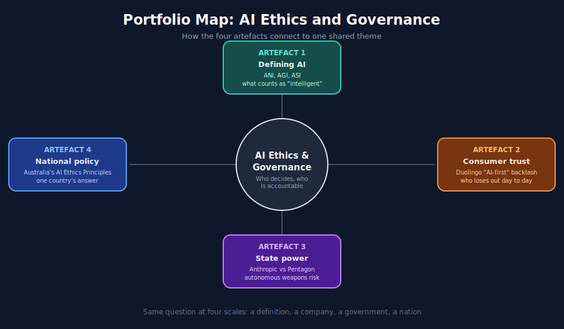
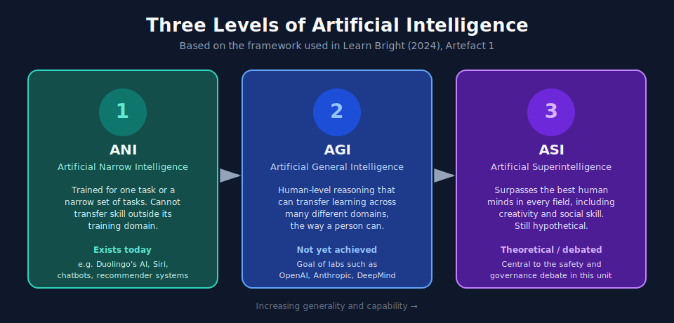

# COIT11223 e-portfolio 1: Artificial Intelligence

A collection of artefacts that demonstrate what I have learnt about Artificial Intelligence during Week 2 of ICT Ethics and Governance in Society.

## Workshop 2 attendance

[Insert your Workshop 2 selfie here, e.g. ``, required as evidence of attendance/engagement.]

## Portfolio map

## Artefact 1: What Is AI? | Learn all about artificial intelligence

https://www.youtube.com/watch?v=JcXKbUIebrU

The video frames three levels: ANI (Artificial Narrow Intelligence), task-specific AI like chatbots and recommenders, is the only one that exists today. AGI (Artificial General Intelligence) would reason across domains at human level but has not been built. ASI (Artificial Superintelligence) would exceed humans in every field and remains purely theoretical, though it is central to the AI safety debate raised later in this portfolio (see Artefact 3).

### Summary of the artefact

Learn Bright (2024) produced a short explainer video that breaks artificial intelligence down into three levels: narrow AI (ANI), general AI (AGI), and superintelligence (ASI), and walks through everyday examples such as voice assistants and chatbots. The video also weighs benefits, including automating dangerous tasks, against drawbacks such as job losses and the potential for AI to be weaponised.

### Justification on why I chose the artefact

I chose this artefact because it matched what we covered on AI definitions in the Week 2 workshop, particularly the difficulty of pinning down what "intelligence" even means (McCarthy 1955, cited in Galea 2026, p. 8). It gave me a plain-language starting point before the more technical workshop content on machine learning and generative AI, and it reminded me that framing AI purely by its "pros and cons" can hide harder governance questions.

## Artefact 2: Duolingo's CEO outlined his plan to become an 'AI-first' company. He didn't expect the human backlash that followed

https://fortune.com/2025/06/09/duolingo-ceo-surprised-backlash-ai-first-company-announcement/

### Summary of the artefact

Braun (2025) reports that Duolingo CEO Luis von Ahn announced in April 2025 that the language-learning app would become "AI-first," phasing out contractors wherever AI could do their work. The plan sparked immediate public backlash, with users threatening to cancel subscriptions and delete the app, forcing von Ahn to walk it back a week later and clarify that AI was meant to accelerate, not replace, human staff.

### Justification on why I chose the artefact

I chose this over a more technical AI story because everyone recognises Duolingo and its owl mascot, which makes the discomfort of a familiar app announcing it would cut humans for AI easy to grasp. It mirrors the Week 2 workshop's benefits-versus-drawbacks framing of AI, including job losses, but shows accountability is not only a matter for autonomous weapons or hospital algorithms: ordinary consumer products raise the same "who loses out" question. Von Ahn's own admission that he "did not expect the amount of blowback" shows even AI companies can misjudge how personally people feel about being replaced.

## Artefact 3: Trump orders US government to cut ties with Anthropic; Hegseth declares supply chain 'risk'

https://abcnews.com/Politics/anthropic-latest-pentagon-contract-bar-ai-autonomous-weapons/story?id=130558898

### Summary of the artefact

Wang (2026) covers the Trump administration ordering all US federal agencies to stop using Anthropic's AI after the company refused Pentagon contract terms that would have allowed its models to be used for autonomous weapons targeting and mass domestic surveillance, with a six-month phase-out period for departments already relying on the technology.

### Justification on why I chose the artefact

This links directly to the workshop's autonomous weapons discussion, where we considered whether fully autonomous "killer robots" making independent kill decisions should ever be allowed. Anthropic drawing a hard line, and a government retaliating over it, showed me this is not a hypothetical dilemma but a live governance fight happening right now between technologists and the state, exactly the tension Human Rights Watch's campaign against fully autonomous weapons warns about.

## Artefact 4: Australia's AI Ethics Principles

https://www.industry.gov.au/publications/australias-ai-ethics-principles

### Summary of the artefact

The Department of Industry, Science and Resources (2025) sets out Australia's eight AI Ethics Principles, covering wellbeing, human-centred values, fairness, privacy, transparency, contestability, safety, and accountability, which now underpin the government's wider AI Impact Assessment Tool used to review AI systems before public agencies deploy them.

### Justification on why I chose the artefact

I chose this artefact because it grounds the more abstract ethical concerns raised elsewhere in this portfolio, like bias in facial recognition or unaccountable machine learning decisions, in an actual governance framework rather than just a classroom debate. Comparing Australia's principles-based approach to the EU's stricter, rules-heavy model from the workshop helped me see that "ethical AI" is not one fixed global standard but a policy choice each country is still working out.

## AI usage statement

[Required by the task guide: briefly describe, in your own words, how you used AI during planning/research only, e.g.: "I used an AI tool to help shortlist candidate artefacts and check my Harvard referencing format. All summaries, justifications, and reflections were written and verified by me." Edit this to reflect what you actually did.]

## References

Braun, S 2025, 'Duolingo's CEO outlined his plan to become an 'AI-first' company. He didn't expect the human backlash that followed', *Fortune*, 9 June, viewed 23 July 2026, https://fortune.com/2025/06/09/duolingo-ceo-surprised-backlash-ai-first-company-announcement/

Department of Industry, Science and Resources 2025, *Australia's AI ethics principles*, viewed 16 July 2026, https://www.industry.gov.au/publications/australias-ai-ethics-principles

Galea, G 2026, *Week 2 Workshop: Artificial Intelligence*, COIT11223: ICT Ethics and Governance in Society, CQUniversity, viewed 16 July 2026, http://moodle.cqu.edu.au

Learn Bright 2024, *What is AI? | Learn all about artificial intelligence*, video, YouTube, viewed 16 July 2026, https://www.youtube.com/watch?v=JcXKbUIebrU

Wang, S 2026, 'Trump orders US government to cut ties with Anthropic; Hegseth declares supply chain "risk"', *ABC News*, 28 February, viewed 23 July 2026, https://abcnews.com/Politics/anthropic-latest-pentagon-contract-bar-ai-autonomous-weapons/story?id=130558898
