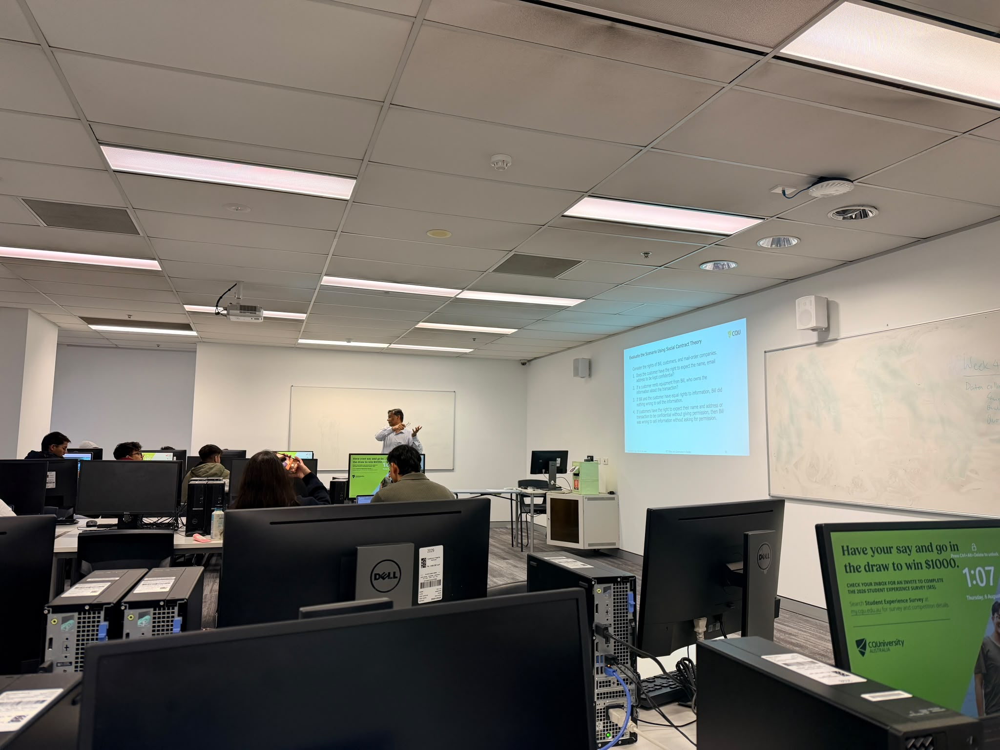

# COIT11223 e-portfolio 2: Ethical Theory

Four artefacts showing what I learned in Week 4 of ICT Ethics and Governance in Society: three real-world ICT dilemmas, each tied to a different ethical theory, and a personal reflection on the workshop itself.

## Workshop 4 attendance

Proof of attendance at the Week 4 workshop for ICT Ethics and Governance in Society.

## Artefact 1: Cornered by the UK's Demand for an Encryption Backdoor, Apple Turns Off Its Strongest Security Setting

https://www.eff.org/deeplinks/2025/02/cornered-uks-demand-encryption-backdoor-apple-turns-its-strongest-security-setting

### Summary of the artefact

Klosowski and Crocker (2025) report that Apple pulled Advanced Data Protection, its iCloud encryption, from UK users after the government secretly ordered a backdoor under the Investigatory Powers Act. That exposed users everywhere to greater risk. Apple is now fighting a second order in court.

### Justification on why I chose the artefact

I assumed backdoors were a fair trade: less privacy for more security. Kantianism from Week 4 (Galea 2026b) changed that. A backdoor treats every device as a means to a government's end, not something owed privacy in itself, and you cannot will that without breaking the right it claims to protect. I don't believe "only the guilty have something to hide" anymore. It left me wary.

## Artefact 2: Rideshare Drivers Sue Uber Over Being Kicked Off App in New Challenge to California Law

https://calmatters.org/economy/2026/04/uber-proposition22-lawsuit/

### Summary of the artefact

Sumagaysay (2026) covers California rideshare drivers suing Uber for never building the appeals process promised under Proposition 22. Drivers describe being locked out by an algorithm with no explanation. One driver said the deactivation put him at risk of homelessness.

### Justification on why I chose the artefact

This is Act and Rule Utilitarianism arguing with each other, the tension Week 4 raised (Galea 2026b). Act by act, instant deactivation looks efficient. As a blanket rule, though, deactivate-first-appeal-never causes real harm, since a driver can lose income overnight. I used to treat "the algorithm decided" as blameless. It isn't. Somebody chose not to add human review.

## Artefact 3: German IT Consultant Fined Thousands for Reporting Security Failing

https://www.darkreading.com/remote-workforce/german-it-consultant-charged-in-court-after-discovering-vulnerability-

### Summary of the artefact

Beek (2024) reports that German contractor Hendrik H. was fined €3,000 after finding that Modern Solution GmbH had stored a database password in plain text, exposing nearly 700,000 customers' data. He reported the flaw. The company accused him of insider access, filed a criminal complaint, and he was found guilty.

### Justification on why I chose the artefact

I assumed responsible disclosure was the safe, ethical choice. This fits Virtue Ethics from Week 4 (Galea 2026b) instead. Hendrik H. showed the honesty the theory prizes and was punished for it anyway, while the company that exposed the data faced no consequence. It left me unsettled. "Ethical hacker" now looks less like a compliment and more like a legal bet.

## Artefact 4: Workshop Personal Reflection

### Summary of the artefact

In the Week 4 workshop we ran the same App Release Dilemma case study through Kantianism, Act Utilitarianism, Rule Utilitarianism, Social Contract Theory and Virtue Ethics, compared the verdicts, and argued about whether breaking the law is ever justified (Galea 2026b).

### Justification on why I chose the artefact

The idea that stood out most was the App Release Dilemma: a software engineer deciding whether to ship an app with known drawbacks. I said in class that the engineer should be upfront with investors and customers about the risks, even if it means a later, safer release. It's a tough call, but a respectable one, since it protects the people who trust the product and earns their respect. Before Week 4 I assumed the five theories were just different routes to the same "right" answer. Watching each one reach a different verdict on the same case changed that: they weigh intention, outcome, character and consent differently, and can genuinely clash. It also brought back Week 1's question of why ICT needs governance (Galea 2026a). The discussion left me feeling more responsible than certain. I now ask which theory a company is implicitly using before I judge its decisions.

## AI usage statement

I used an AI tool to research candidate artefacts on the ethical-theory topic, find credible and current sources, and check my citations against the CQU Harvard referencing style. I then read those sources myself and wrote all of my own summaries, justifications, and reflections in my own words.

## References

Beek, K 2024, 'German IT consultant fined thousands for reporting security failing', *Dark Reading*, 22 January, viewed 6 August 2026, https://www.darkreading.com/remote-workforce/german-it-consultant-charged-in-court-after-discovering-vulnerability-

Galea, G 2026a, 'Week 1 workshop: the information age', PowerPoint presentation, COIT11223: ICT Ethics and Governance in Society, CQUniversity, viewed 6 August 2026, http://moodle.cqu.edu.au/

Galea, G 2026b, 'Week 4 workshop: morality and ethics', PowerPoint presentation, COIT11223: ICT Ethics and Governance in Society, CQUniversity, viewed 6 August 2026, http://moodle.cqu.edu.au/

Klosowski, T & Crocker, A 2025, 'Cornered by the UK's demand for an encryption backdoor, Apple turns off its strongest security setting', *Electronic Frontier Foundation*, 21 February, viewed 6 August 2026, https://www.eff.org/deeplinks/2025/02/cornered-uks-demand-encryption-backdoor-apple-turns-its-strongest-security-setting

Sumagaysay, L 2026, 'Rideshare drivers sue Uber over being kicked off app in new challenge to California law', *CalMatters*, 20 April, viewed 6 August 2026, https://calmatters.org/economy/2026/04/uber-proposition22-lawsuit/
