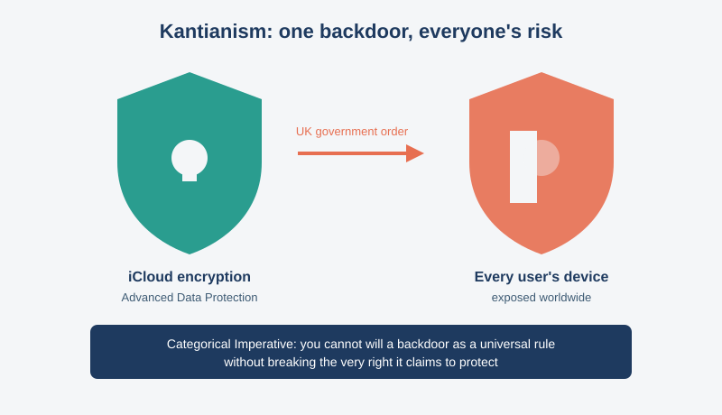
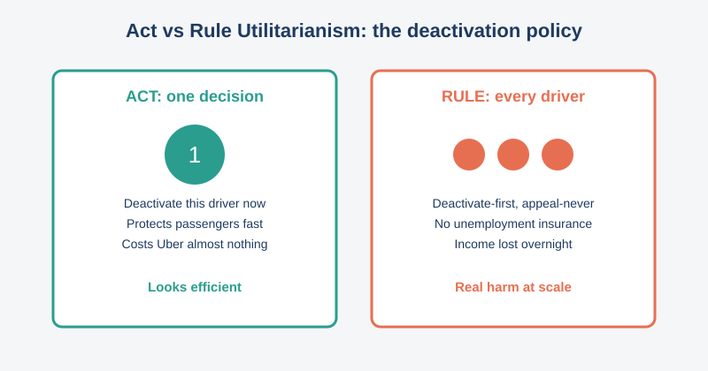
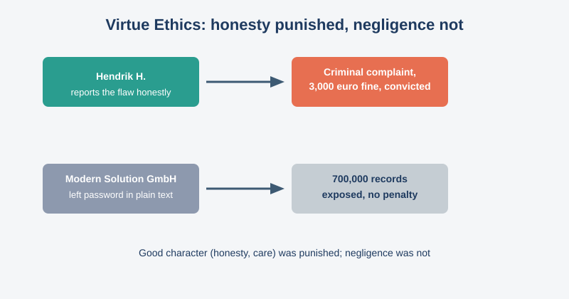
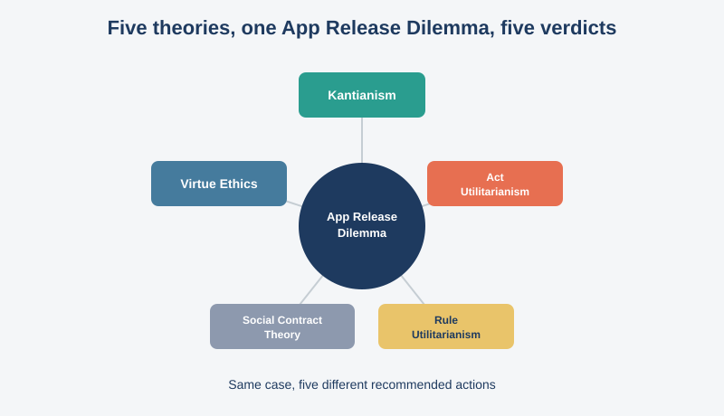

# COIT11223 e-portfolio 2: Ethical Theory

A group of artefacts that indicate what I have learned in Week 4 of ICT Ethics and Governance in Society. Three artefacts are unique real-world ICT dilemmas, each connected to a different ethical theory from the unit; the fourth is a personal reflection on the Week 4 workshop itself.

## Workshop 4 attendance

Proof of attendance at the Week 4 workshop for ICT Ethics and Governance in Society.

> Note: the attendance photo is referenced above but hasn't been added to `images/` yet, pending upload.

## Artefact 1: Cornered by the UK's Demand for an Encryption Backdoor, Apple Turns Off Its Strongest Security Setting

https://www.eff.org/deeplinks/2025/02/cornered-uks-demand-encryption-backdoor-apple-turns-its-strongest-security-setting

### Summary of the artefact

Klosowski and Crocker (2025) report that Apple removed Advanced Data Protection, its end-to-end iCloud encryption, from all UK users after the UK government secretly ordered a backdoor under the Investigatory Powers Act. Complying would have exposed Apple users everywhere to greater hacking and fraud risk. Apple is now challenging a second UK order in court.

### Justification on why I chose the artefact

I assumed backdoors were a fair trade: less privacy for more security. Kantianism from Week 4 (Galea 2026b) changed that. A backdoor treats every device as a means to a government's end, not something owed privacy in itself, and the Categorical Imperative says you cannot will that as a universal rule without breaking the right you claim to protect. I don't believe "only the guilty have something to hide" anymore.

## Artefact 2: Rideshare Drivers Sue Uber Over Being Kicked Off App in New Challenge to California Law

https://calmatters.org/economy/2026/04/uber-proposition22-lawsuit/

### Summary of the artefact

Sumagaysay (2026) reports that California rideshare drivers are suing Uber for never building the appeals process it promised under Proposition 22. Drivers describe being locked out by an algorithm with no reason given, then routed through scripted, overseas support. One driver said his deactivation left him at risk of homelessness.

### Justification on why I chose the artefact

This is Act and Rule Utilitarianism arguing with each other, exactly the tension Week 4 raised (Galea 2026b). Act by act, instant deactivation looks efficient. As a blanket rule, though, deactivate-first-appeal-never causes real harm at scale, since a driver with no unemployment insurance can lose their income overnight. I used to treat "the algorithm decided" as blameless. It isn't; somebody chose not to add human review.

## Artefact 3: German IT Consultant Fined Thousands for Reporting Security Failing

https://www.darkreading.com/remote-workforce/german-it-consultant-charged-in-court-after-discovering-vulnerability-

### Summary of the artefact

Beek (2024) reports that German contractor Hendrik H. was fined €3,000 after discovering that Modern Solution GmbH had stored a database password in plain text, exposing nearly 700,000 customers' data. He reported the flaw; the company accused him of insider access and filed a criminal complaint. A German court found him guilty, and he planned to appeal.

### Justification on why I chose the artefact

I assumed responsible disclosure was the safe, obviously ethical choice. This case fits Virtue Ethics from Week 4 (Galea 2026b) instead: Hendrik H. showed the honesty and care the theory prizes and was punished anyway, while the company that exposed the data faced no equivalent consequence. "Ethical hacker" now looks less like a compliment and more like a legal bet.

## Artefact 4: Workshop Personal Reflection

### Summary of the artefact

In the Week 4 workshop we applied Kantianism, Act Utilitarianism, Rule Utilitarianism, Social Contract Theory and Virtue Ethics to the same App Release Dilemma case study, compared the theories directly, and discussed the morality of breaking the law (Galea 2026b).

### Justification on why I chose the artefact

I assumed ethical theories were interchangeable routes to the same "obviously right" answer, so running one scenario through five felt redundant going in. Getting a different verdict from each theory is what made Week 4 land for me: they weigh completely different things, intention, outcome, character, consent, and can genuinely conflict. It also brought back Week 1's question of why ICT needs governance (Galea 2026a). It has changed how I read tech ethics news: I now ask which theory a company is implicitly using before deciding if I agree.

## AI usage statement

I used an AI tool to research candidate artefacts on the ethical-theory topic, find credible and current sources, and check my citations against the CQU Harvard referencing style. I then read those sources myself and wrote all of my own summaries, justifications, and reflections in my own words.

## References

Beek, K 2024, 'German IT consultant fined thousands for reporting security failing', *Dark Reading*, 22 January, viewed 6 August 2026, https://www.darkreading.com/remote-workforce/german-it-consultant-charged-in-court-after-discovering-vulnerability-

Galea, G 2026a, 'Week 1 workshop: the information age', PowerPoint presentation, COIT11223: ICT Ethics and Governance in Society, CQUniversity, viewed 6 August 2026, http://moodle.cqu.edu.au/

Galea, G 2026b, 'Week 4 workshop: morality and ethics', PowerPoint presentation, COIT11223: ICT Ethics and Governance in Society, CQUniversity, viewed 6 August 2026, http://moodle.cqu.edu.au/

Klosowski, T & Crocker, A 2025, 'Cornered by the UK's demand for an encryption backdoor, Apple turns off its strongest security setting', *Electronic Frontier Foundation*, 21 February, viewed 6 August 2026, https://www.eff.org/deeplinks/2025/02/cornered-uks-demand-encryption-backdoor-apple-turns-its-strongest-security-setting

Sumagaysay, L 2026, 'Rideshare drivers sue Uber over being kicked off app in new challenge to California law', *CalMatters*, 20 April, viewed 6 August 2026, https://calmatters.org/economy/2026/04/uber-proposition22-lawsuit/
