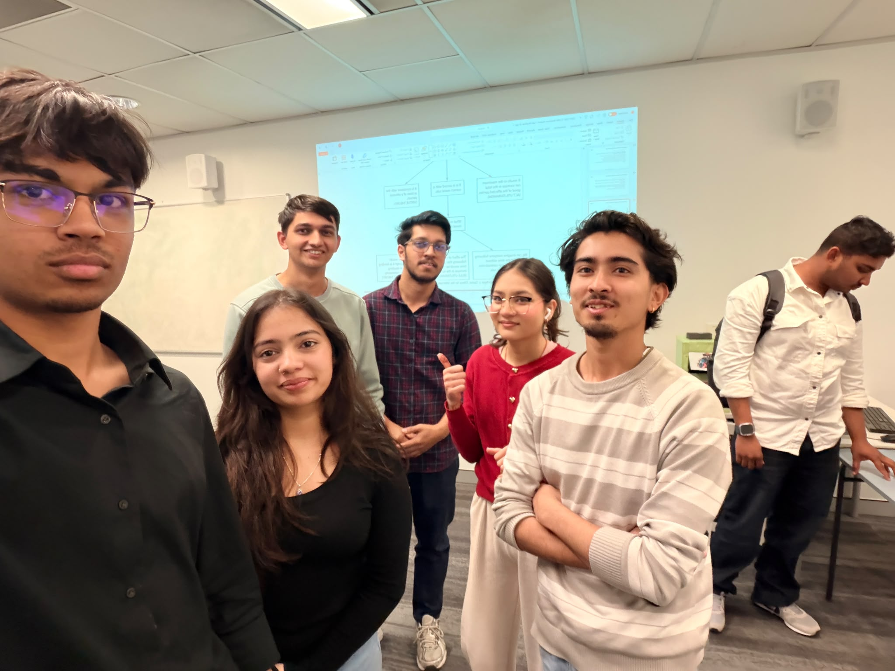

# COIT11223 e-portfolio 2: Ethical Theory

A group of artefacts that indicate what I have learned in Week 4 of ICT Ethics and Governance in Society. Three artefacts are unique real-world ICT dilemmas, each connected to a different ethical theory from the unit; the fourth is a personal reflection on the Week 4 workshop itself.

## Workshop 4 attendance

Proof of attendance at the Week 4 workshop for ICT Ethics and Governance in Society.

> Note: the attendance photo is referenced above but hasn't been added to `images/` yet, pending upload.

## Artefact 1: Cornered by the UK's Demand for an Encryption Backdoor, Apple Turns Off Its Strongest Security Setting

https://www.eff.org/deeplinks/2025/02/cornered-uks-demand-encryption-backdoor-apple-turns-its-strongest-security-setting

### Summary of the artefact

According to Klosowski and Crocker (2025), Apple removed Advanced Data Protection, the end-to-end encryption for iCloud backups, from all UK customers following an unpublicised request from the UK government under the Investigatory Powers Act to create a backdoor. It would have left Apple's users, not just in the UK, more exposed to hacking, identity theft, and fraud. Apple has since gone on the offensive and is now challenging a second UK order in court.

### Justification on why I chose the artefact

I had entered with the assumption that backdoors were a fair exchange, because a little less privacy would buy a lot more security. That was until Kantianism was applied from Week 4 (Galea 2026c). A backdoor is a tool for a government investigation, not something that merits privacy protection on its own, and Kant's Categorical Imperative says you cannot will that as a universal rule without breaking the very right you espouse to protect. It also reinforced the Week 3 content on data communications, on losing control over your own information (Galea 2026b). I don't believe "only the guilty have something to hide" anymore.

## Artefact 2: Rideshare Drivers Sue Uber Over Being Kicked Off App in New Challenge to California Law

https://calmatters.org/economy/2026/04/uber-proposition22-lawsuit/

### Summary of the artefact

Sumagaysay (2026) reports that California rideshare drivers are suing Uber, claiming the company failed to build the appeals process it promised drivers under Proposition 22, the ballot initiative that classified them as independent contractors while promising deactivated drivers a way to appeal. Drivers report being effectively locked out by an algorithm for no apparent reason, then routed through scripted, overseas support before, if at all, reaching someone who can help. One driver interviewed said he was at risk of becoming homeless because of his deactivation.

### Justification on why I chose the artefact

This is the Act and Rule Utilitarianism debate, and that is exactly how the tension between them was presented in Week 4 (Galea 2026c). Looked at act by act, instant automated deactivation appears efficient: it can help passengers quickly and costs Uber almost nothing to run. But applied as a blanket rule across all drivers, a deactivate-first-appeal-never policy does real harm at scale, because a driver with no unemployment insurance can lose his or her income in an instant. Until now, I had always treated "the algorithm decided" as a blameless explanation. It isn't. Somebody chose not to add a human review step, so this is a policy choice with real consequences, not a technical inevitability.

## Artefact 3: German IT Consultant Fined Thousands for Reporting Security Failing

https://www.darkreading.com/remote-workforce/german-it-consultant-charged-in-court-after-discovering-vulnerability-

### Summary of the artefact

Beek (2024) reports that a German IT contractor, Hendrik H., was fined €3,000 after discovering that Modern Solution GmbH had stored a database password in plain text, exposing nearly 700,000 customers' personal information. He reported the flaw, but the company claimed he must have had inside access to the system to find the password, and filed a criminal complaint. A German court found him guilty under the country's hacking law, and he planned to appeal.

### Justification on why I chose the artefact

I would have assumed the safe, obviously ethical choice was to report it quietly, let the company fix it, and everyone wins. This case says otherwise, and it fits cleanly with Virtue Ethics from Week 4 (Galea 2026c). The theory says good character is shown through traits like honesty and care, and Hendrik H. showed exactly that; he was still punished, while the company that left the data exposed faced no equivalent consequence. It also links to Week 3's hacking material on where the line sits between disclosure that helps and access the law treats as identical to malicious hacking (Galea 2026b). What I used to think of as an "ethical hacker" now looks less like a compliment and more like a legal bet.

## Artefact 4: Workshop Personal Reflection

### Summary of the artefact

In the Week 4 workshop we worked through the App Release Dilemma case study, applying Kantianism, Act Utilitarianism, Rule Utilitarianism, Social Contract Theory and Virtue Ethics to the same scenario in turn, before comparing the theories directly against each other and discussing the morality of breaking the law (Galea 2026c).

### Justification on why I chose the artefact

Before this workshop I assumed ethical theories were mostly interchangeable ways of reaching the same "obviously right" answer, so running one scenario through five of them felt redundant going in. Getting a different recommended action from each theory is what actually made Week 4's content land for me (Galea 2026c): these theories are not paraphrasing each other, they weigh completely different things, intention, outcome, character, and consent, and can genuinely conflict. The morality of breaking the law discussion stuck with me most, because it is the same question running through the other three artefacts in this portfolio: the encryption case, the vulnerability disclosure case, and the deactivated Uber drivers all come down to whether breaking a rule can be the more ethical choice. Comparing the theories side by side, rather than reading about them separately, is what made that click. It also brought back Week 1's question of why ICT needs governance in the first place (Galea 2026a): watching five theories reach five different verdicts on the same case made it clear that ethics is not one settled checklist ICT professionals can just follow. It has changed how I read news stories about tech ethics: I now ask which theory a company or regulator is implicitly using before deciding whether I agree with them.

## AI usage statement

I used an AI tool to research candidate artefacts on the ethical-theory topic, find credible and current sources, and check my citations against the CQU Harvard referencing style. I then read those sources myself and wrote all of my own summaries, justifications, and reflections in my own words.

## References

Beek, K 2024, 'German IT consultant fined thousands for reporting security failing', *Dark Reading*, 22 January, viewed 6 August 2026, https://www.darkreading.com/remote-workforce/german-it-consultant-charged-in-court-after-discovering-vulnerability-

Galea, G 2026a, 'Week 1 workshop: the information age', PowerPoint presentation, COIT11223: ICT Ethics and Governance in Society, CQUniversity, viewed 6 August 2026, http://moodle.cqu.edu.au/

Galea, G 2026b, 'Week 3 workshop: data communications', PowerPoint presentation, COIT11223: ICT Ethics and Governance in Society, CQUniversity, viewed 6 August 2026, http://moodle.cqu.edu.au/

Galea, G 2026c, 'Week 4 workshop: morality and ethics', PowerPoint presentation, COIT11223: ICT Ethics and Governance in Society, CQUniversity, viewed 6 August 2026, http://moodle.cqu.edu.au/

Klosowski, T & Crocker, A 2025, 'Cornered by the UK's demand for an encryption backdoor, Apple turns off its strongest security setting', *Electronic Frontier Foundation*, 21 February, viewed 6 August 2026, https://www.eff.org/deeplinks/2025/02/cornered-uks-demand-encryption-backdoor-apple-turns-its-strongest-security-setting

Sumagaysay, L 2026, 'Rideshare drivers sue Uber over being kicked off app in new challenge to California law', *CalMatters*, 20 April, viewed 6 August 2026, https://calmatters.org/economy/2026/04/uber-proposition22-lawsuit/
