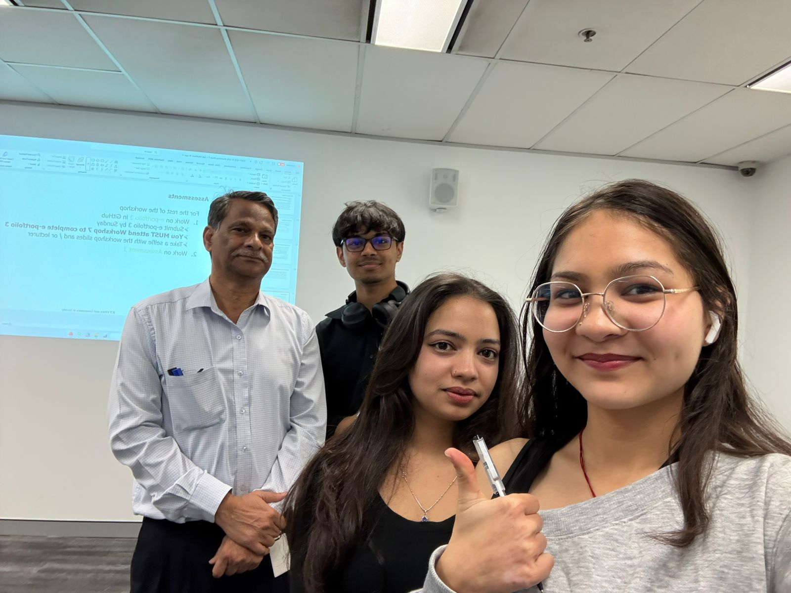

# COIT11223 e-portfolio 3: Intellectual Property

Four artefacts showing what I learned in Week 7 of ICT Ethics and Governance in Society: three real-world intellectual property disputes spanning education, defence, and healthcare, and a personal reflection on the workshop itself.

## Workshop 7 attendance

Proof of attendance at the Week 7 workshop for ICT Ethics and Governance in Society.

## Artefact 1: Authors, publishers sue Google over alleged AI copyright infringement

https://www.aljazeera.com/economy/2026/7/15/authors-publishers-sue-google-over-alleged-ai-copyright-infringement

### Summary of the artefact

Hirschfeld (2026) reports that Hachette Book Group, Cengage Learning, Elsevier, and author Scott Turow sued Google in federal court, alleging Google used books obtained through Google Books, alongside web-scraped and pirated material, to train its Gemini AI model without authorisation or payment. The complaint covers "educational works and scholarly articles that span thousands of subject areas," not just fiction, and cites internal Google documents that reportedly warned the practice was "highly problematic" and could carry $100 billion in fines.

### Justification on why I chose the artefact

I picked this over a generic AI-copyright story because a textbook publisher is the plaintiff here, not just a novelist, and that lines up with Week 7's point that copyright protects a work's expression automatically on creation, computer programs and databases included (Galea 2026). I'd assumed AI training on scraped text was a grey area the law hadn't caught up to yet. Then I read that Google's own lawyers called it "highly problematic" internally before it happened anyway, and that assumption fell apart, that's not an unclear law being tested in good faith, it's a company deciding litigation is cheaper than licensing. It also connects to the ownership discussion in Artefact 4: if a company can knowingly take that risk with someone else's work and still keep the trained model, "who owns the output" feels secondary to who got to make that call at all.

## Artefact 2: Patent fight becomes part of U.S.-China AI security debate

https://www.tpr.org/podcast/the-source/2026-05-25/patent-fight-becomes-part-of-u-s-china-ai-security-debate

### Summary of the artefact

Davies (2026) covers how U.S. patent system reform has become entangled with AI competition and national security. Randy Landreneau of U.S. Inventor argues that Patent Trial and Appeal Board rulings have made patents less reliable and harder for small inventors to defend, discouraging investment, while WIPO data shows Chinese inventors filed over 38,000 generative AI patent families between 2014 and 2023, outpacing the U.S. The National Security Commission on Artificial Intelligence warned this leaves the U.S. underprepared as AI increasingly supports military planning and cyber defence.

### Justification on why I chose the artefact

Week 7 framed patents as a compromise, protection for inventors so society still benefits once an invention is eventually public (Galea 2026). This artefact shows that compromise being renegotiated for a different reason entirely, national competitiveness, not public benefit. My first reaction was that weakening patent protection to help small inventors sounded like a clearly good, pro-inventor move. Reading further complicated that: at a national level it can read as self-inflicted disadvantage against a competitor filing at a faster rate. I'm still not sure which side is right, and I don't think there's one "correct" strength for patent rights independent of what a country is actually protecting, its inventors, or its global position. Those aren't always the same goal.

## Artefact 3: Bridging the global gap in access to essential medicines

https://www.ohchr.org/en/stories/2025/07/bridging-global-gap-access-essential-medicines

### Summary of the artefact

Fyfe (2025), writing for the UN Human Rights Office, reports that two billion people globally lack access to essential medicines, with patent-driven pricing identified as a primary barrier. The piece notes that while patents have funded genuine medical innovation, they simultaneously leave diseases affecting low-income populations under-researched, since a small commercial market gives patent holders little incentive to develop treatments for them. Around 1.65 million people, mostly in 16 low- and middle-income countries, currently need treatment for neglected tropical diseases.

### Justification on why I chose the artefact

I chose this deliberately over another AI story, to test the "limited-time compromise" idea from Week 7 (Galea 2026) against people instead of products. The workshop's justification for IP protection is that society benefits once inventions eventually reach the public domain. For two billion people without access to essential medicines, that "eventually" is doing quiet damage the whole time, potentially someone's whole life. This is the one artefact here that isn't really about technology, it's about whose life a patent term is allowed to cost, and reading it against Artefact 4's question of who deserves ownership and reward made me realise the same tension runs under both: protection is supposed to reward whoever creates value, but it rarely asks what that protection costs everyone else while it runs.

## Artefact 4: Workshop Personal Reflection

### Summary of the artefact

The Week 7 workshop opened with the monkey selfie case: does the monkey who pressed the shutter own the photo, or the photographer who owns the camera and set up the shot? The discussion moved from there into AI, asking the same ownership question about AI-generated work: does the person who wrote the prompt own the output, or does the company running the data centres that generated it? Galea (2026) noted there is no dedicated AI copyright law yet, so AI-generated work currently falls outside copyright protection either way, no one owns it in a legal sense.

### Justification on why I chose the artefact

My own take, and the part I kept turning over after class, is about accountability. If something goes wrong because of how someone prompted an AI, that person is the one held responsible, not the company that built the model. If responsibility for a bad outcome sits with the prompter, credit for a good one should sit there too, since what's being rewarded is the idea and the intent behind the prompt, not the infrastructure that ran it. I don't think that holds all the way through, though: the idea couldn't have existed without the company's compute providing the means to execute it, so in a legal sense the company probably deserves a share, a royalty or a partial benefit, not the whole product and not nothing either. That connects to something we covered later in the same workshop, the Nike logo example, where seeing the logo makes you think of the company and the shoe before anything else. I think a watermark on AI output works the same way: a watermark, like the one NotebookLM puts on generated slides or videos, signals the brand and flags that AI was involved, so a good output reflects well on the company and a bad one reflects badly on it. But that's a branding effect, not an ownership claim. Ownership of what was actually made should still sit with the person who created it.

## AI usage statement

I used an AI tool to research candidate artefacts on the intellectual property topic, find credible and current sources, and check my citations against the CQU Harvard referencing style. I then read those sources myself and wrote all of my own summaries, justifications, and reflections in my own words.

## References

Davies, DM 2026, 'Patent fight becomes part of U.S.-China AI security debate', *Texas Public Radio*, 25 May, viewed 3 September 2026, https://www.tpr.org/podcast/the-source/2026-05-25/patent-fight-becomes-part-of-u-s-china-ai-security-debate

Fyfe, D 2025, 'Bridging the global gap in access to essential medicines', *OHCHR*, 17 July, viewed 3 September 2026, https://www.ohchr.org/en/stories/2025/07/bridging-global-gap-access-essential-medicines

Galea, G 2026, 'Week 7 workshop: intellectual property', PowerPoint presentation, COIT11223: ICT Ethics and Governance in Society, CQUniversity, viewed 3 September 2026, http://moodle.cqu.edu.au/

Hirschfeld, A 2026, 'Authors, publishers sue Google over alleged AI copyright infringement', *Al Jazeera*, 15 July, viewed 3 September 2026, https://www.aljazeera.com/economy/2026/7/15/authors-publishers-sue-google-over-alleged-ai-copyright-infringement
