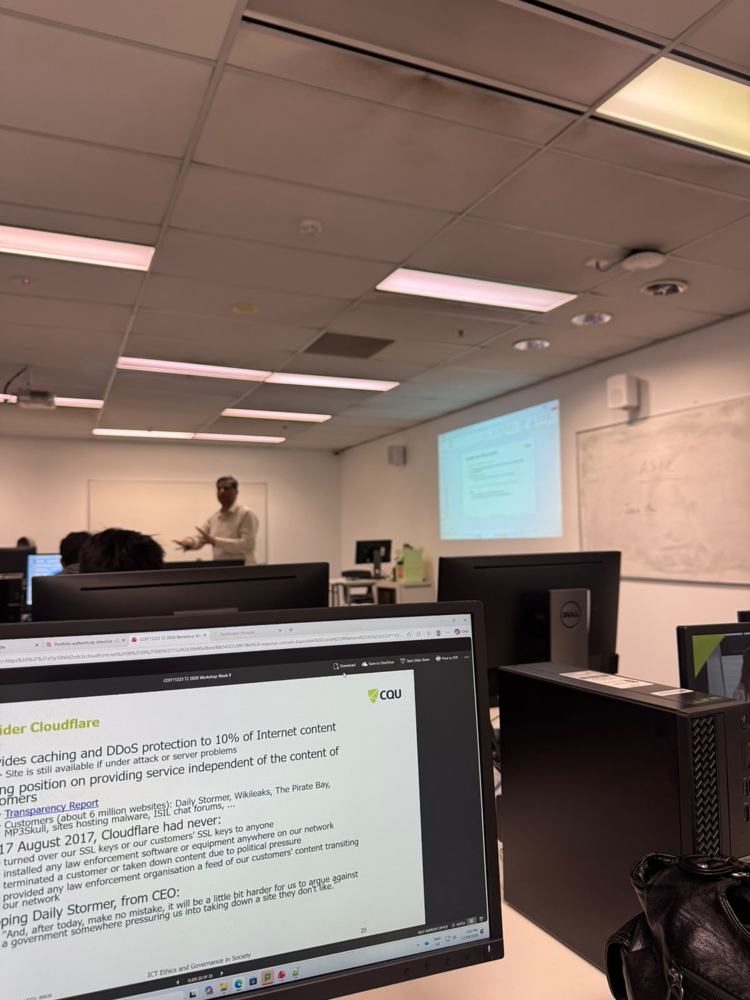
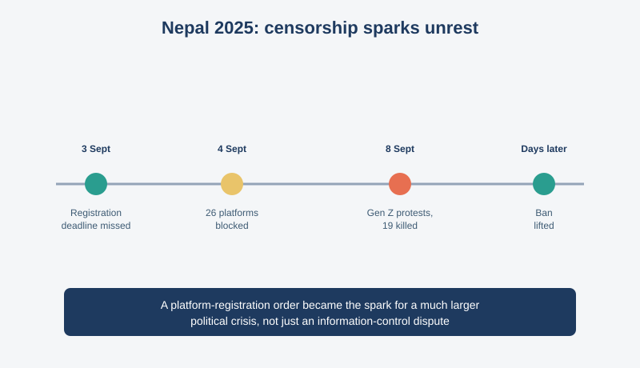
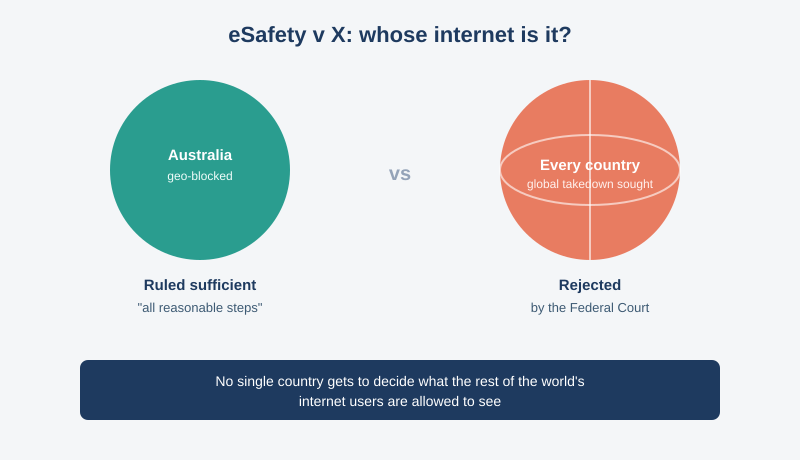
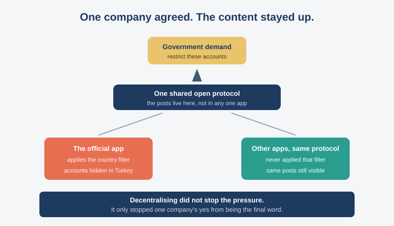
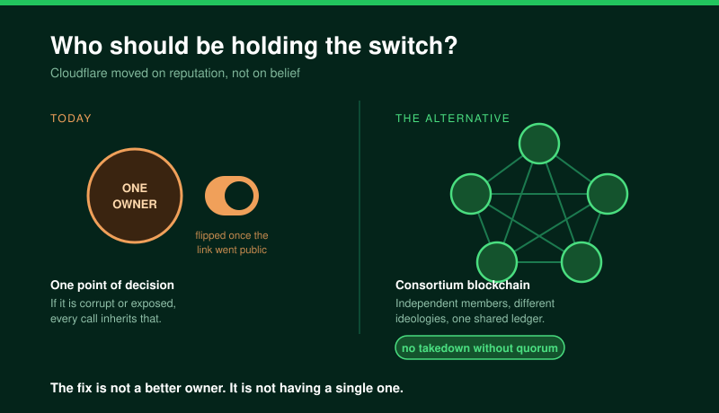

# COIT11223 e-portfolio 4: Censorship and Government

Four artefacts from Week 9 of ICT Ethics and Governance in Society: three real censorship disputes and a personal workshop reflection.

## Workshop 9 attendance

Attendance confirmation for the Week 9 workshop. The second photo shows the Cloudflare slide that Artefact 4 reflects on.

## Artefact 1: Six killed in Nepal amid Gen Z protests after social media ban: All to know

https://www.aljazeera.com/news/2025/9/8/six-killed-in-nepal-amid-gen-z-protests-after-social-media-ban-all-to-know

### Summary of the artefact

Shamim (2025) reports that Nepal blocked 26 platforms, including Facebook and YouTube, after they missed a registration deadline, officially to curb fake accounts and cybercrime. Youth-led protests over the ban and government corruption turned deadly when police fired on crowds; at least 19 died before the ban was lifted.

### Justification on why I chose the artefact

A trend exposing politicians' children living lavishly was already spreading before any of this (Dudraj 2025), and the ban arrived right after, officially over a missed deadline. That timing is hard to take at face value. It shows what centralised control looks like when the people doing the filtering have something to lose themselves, which is why I land on a consortium blockchain in Artefact 4.

## Artefact 2: Powers of Online Safety Act tested in Federal Court case

https://www.hrlc.org.au/case-summaries/2024-06-19-esafety-commissioner-v-x-corp/

### Summary of the artefact

Human Rights Law Centre (2024) reports on *eSafety Commissioner v X Corp*, where eSafety wanted 65 links to graphic stabbing footage removed worldwide. X had already blocked it for Australian users, and the Federal Court ruled that was enough under the Online Safety Act, refusing a global order.

### Justification on why I chose the artefact

The workshop used this case to ask where protecting people online turns into restricting freedom, so I wanted to see how a court answered it. I assumed removing clearly harmful content was uncontroversial, but the ruling treats the global internet as beyond any one country's reach. Censorship turned out to be a jurisdiction problem too.

## Artefact 3: Government censorship comes to Bluesky, but not its third-party apps yet

https://techcrunch.com/2025/04/23/government-censorship-comes-to-bluesky-but-not-its-third-party-apps-yet

### Summary of the artefact

Perez (2025) reports that the Turkish government asked Bluesky to restrict accounts on national security grounds, and Bluesky agreed, hiding around 60 of them from users in Turkey. What matters is where that block sits. Bluesky's posts live on an open protocol rather than inside the company's app, and the filters hiding those accounts were applied by Bluesky's app alone. Other apps reading the same protocol never applied them, so the accounts stayed visible.

### Justification on why I chose the artefact

I picked this because it tests the idea I land on in Artefact 4 rather than just agreeing with it. Bluesky still gave in, so spreading a system out does not stop a government applying pressure. What it stops is that one yes being the end of the matter, because no single company was holding the only copy.

## Artefact 4: Workshop Personal Reflection

### Summary of the artefact

One of the things the tutor put into the spotlight was the Daily Stormer case. GoDaddy and then Google both cancelled the site's domain, but Cloudflare kept it as a customer for days. What finally changed Cloudflare's mind was not the site's content: it was Daily Stormer publicly claiming that Cloudflare secretly supported their ideology, which put the company in a bad spot.

### Justification on why I chose the artefact

What caught my eye is that the decision came down to reputation, not belief. Cloudflare only moved once the association was advertised to the world. That made me ask who should be making these calls at all. A single central authority sounds cleaner, but if that authority is corrupt the bias just moves up one level. My own idea is a consortium blockchain, where a group of independent members runs the ledger together instead of one owner, with AI models built on different ideologies sitting as those members, so a takedown only goes ahead if they agree. Artefact 3 shows that would not stop the pressure, but it would stop one company's decision being the only one that counts.

## AI usage statement

I used an AI tool to research candidate artefacts, find credible sources, check citations against CQU Harvard style, and generate the diagrams. I read those sources and wrote every summary and justification myself.

## References

Dudraj, D 2025, '"Nepo kid" trend sparks anti-corruption campaign in Nepal', *The Kathmandu Post*, 6 September, viewed 17 September 2026, https://kathmandupost.com/national/2025/09/06/nepo-kid-trend-sparks-anti-corruption-campaign-in-nepal

Human Rights Law Centre 2024, 'Powers of Online Safety Act tested in Federal Court case', 19 June, viewed 17 September 2026, https://www.hrlc.org.au/case-summaries/2024-06-19-esafety-commissioner-v-x-corp/

Perez, S 2025, 'Government censorship comes to Bluesky, but not its third-party apps yet', *TechCrunch*, 23 April, viewed 17 September 2026, https://techcrunch.com/2025/04/23/government-censorship-comes-to-bluesky-but-not-its-third-party-apps-yet

Shamim, S 2025, 'Six killed in Nepal amid Gen Z protests after social media ban: All to know', *Al Jazeera*, 8 September, viewed 17 September 2026, https://www.aljazeera.com/news/2025/9/8/six-killed-in-nepal-amid-gen-z-protests-after-social-media-ban-all-to-know
